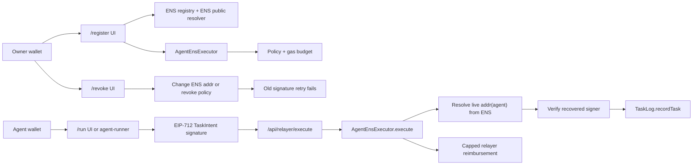

# AgentPassport.eth — ENS-Native Agent Identity

AgentPassport.eth is an ENS-first hackathon project that turns ENS into a public identity and control plane for onchain AI agents.

A user binds an autonomous agent to an ENS subname such as `assistant.alice.eth`, publishes the agent address and metadata in ENS records, and funds a limited execution budget. The agent signs EIP-712 task intents. The executor contract resolves the current agent address from ENS at execution time, verifies the signature, checks policy, executes an allowed task, and reimburses the relayer from the owner-funded gas budget.

## Core demo

1. User owns an ENS name, for example `alice.eth` or a Sepolia test ENS name.
2. User creates/configures an agent subname, for example `assistant.alice.eth`.
3. ENS records are written for the agent:
   - `addr(assistant.alice.eth) = 0xAgent`
   - `text(agent.owner) = alice.eth`
   - `text(agent.capabilities) = task-log,sponsored-execution`
   - `text(agent.executor) = 0xAgentEnsExecutor`
   - `text(agent.status) = active`
4. User creates an onchain policy and deposits a gas budget.
5. Agent signs an EIP-712 intent to record a task onchain.
6. Relayer submits the transaction.
7. `AgentEnsExecutor` resolves the agent address from ENS live, verifies the signature, checks policy, executes `TaskLog.recordTask`, and reimburses the relayer.
8. User revokes the agent by changing the ENS address record or disabling policy.
9. The same old signature now fails, proving ENS is part of authorization and revocation.

## Why ENS is central

ENS is not used as a decorative profile. It provides:

- Human-readable agent identity.
- Live resolution of the authorized signer address.
- Public metadata through text records.
- Discoverability through ENS names/subnames.
- Revocation by changing the ENS record.
- A public control plane for delegated agent execution.

The executor must resolve the agent address from ENS during `execute()`. Do not hard-code or permanently store the agent signer address in the executor.

## Recommended MVP stack

- Frontend: Next.js, TypeScript, wagmi, viem, RainbowKit, Tailwind.
- Contracts: Solidity, Foundry, OpenZeppelin.
- Agent runner: Node.js/TypeScript script that signs EIP-712 typed data.
- Relayer: Next.js API route or small Node service.
- Network: Sepolia first.

## Architecture



The important trust boundary is inside `AgentEnsExecutor`. The contract does not store the agent signer as policy authority. It resolves `addr(agentNode)` from ENS during every execution, then compares the recovered EIP-712 signer to that live ENS result.

## Environment variables

Keep secrets in local `.env` files only. Public values are prefixed with `NEXT_PUBLIC_` because the browser needs them to read Sepolia and render proof panels.

| Variable | Used by | Purpose |
|---|---|---|
| `NEXT_PUBLIC_CHAIN_ID` | Web | Must be Sepolia `11155111` for the MVP. |
| `NEXT_PUBLIC_ENS_REGISTRY` | Web | Sepolia ENS registry address. |
| `NEXT_PUBLIC_NAME_WRAPPER` | Web/contracts | Sepolia NameWrapper address for wrapped-owner checks. |
| `NEXT_PUBLIC_PUBLIC_RESOLVER` | Web | Resolver used when the app creates a new subname. |
| `NEXT_PUBLIC_EXECUTOR_ADDRESS` | Web/relayer | Deployed `AgentEnsExecutor`. |
| `NEXT_PUBLIC_TASK_LOG_ADDRESS` | Web/relayer | Deployed `TaskLog`. |
| `NEXT_PUBLIC_TASK_LOG_START_BLOCK` | Web | Deployment block used to bound `TaskRecorded` event reads. |
| `NEXT_PUBLIC_RPC_URL` | Web | Optional browser read RPC. Leave blank to use wagmi defaults. |
| `RELAYER_PRIVATE_KEY` | Relayer API | Server-only key that broadcasts `execute(...)`. |
| `AGENT_PRIVATE_KEY` | Agent runner | Agent signer used by the CLI runner. |
| `PINATA_JWT` | Web API | Preferred server-only credential for generated policy metadata uploads. |
| `PINATA_API_KEY` / `PINATA_SECRET_API_KEY` | Web API | Alternative server-only Pinata credential pair. |
| `ETHERSCAN_API_KEY` | Contracts | Optional verification key for deployments. |

## Deployed addresses

| Item | Sepolia value |
|---|---|
| `AgentEnsExecutor` | `0xf6902c77f4dF81327ADF86cc484498C467335115` |
| `TaskLog` | `0xe41f0aeeF4e0A84b46448913f51E60640F6c2Bf2` |
| ENS registry | `0x00000000000C2E074eC69A0dFb2997BA6C7d2e1e` |
| NameWrapper | `0x0635513f179D50A207757E05759CbD106d7dFcE8` |

## Setup

Prerequisites:

- Node.js 22 or newer.
- pnpm 9 or newer.
- Foundry for Solidity build, test, and deployment.

Install JavaScript dependencies:

```bash
pnpm install
```

Copy environment templates before running local services:

```bash
cp .env.example .env
cp apps/web/.env.example apps/web/.env.local
cp agent-runner/.env.example agent-runner/.env
cp contracts/.env.example contracts/.env
```

Run the repository structure test:

```bash
pnpm test
```

Run the web app:

```bash
pnpm --filter @agentpassport/web dev
```

Run contract tests after contracts are implemented:

```bash
forge test
```

Run the agent runner after the signing flow is implemented:

```bash
pnpm agent:run
```

## Test commands

```bash
pnpm test
pnpm --filter @agentpassport/web typecheck
pnpm --filter @agentpassport/web build
forge test
```

## Reproduce the Sepolia demo

The judge-facing sequence is:

```txt
ENS name -> agent metadata -> signed task -> live ENS verification -> task execution -> revocation failure
```

1. Start the web app with Sepolia `.env` values:

   ```bash
   pnpm --filter @agentpassport/web dev
   ```

2. Open `/register`, connect the owner wallet, enter the owner ENS name, agent label, agent address, gas budget, and reimbursement cap.
3. Submit registration. The app generates the policy/profile JSON, uploads it through Pinata, writes the returned `ipfs://...` URI and hash into ENS, sets policy, and deposits gas budget.
4. Open `/agent/<agent-name>` and confirm the profile shows live resolver, ENS address, policy, gas budget, text records, and task history.
5. Switch to the agent wallet on `/run`, sign the EIP-712 task intent, and submit it to the relayer.
6. Confirm the task appears in history from the DB and `TaskLog` events.
7. Open `/revoke`, revoke the policy or update `addr(agent)`, then retry the saved old payload.
8. Confirm the retry fails because the recovered signer no longer matches live ENS state or the policy is disabled.

## Known limitations

- Registration policy metadata is generated by the app and pinned through Pinata; Pinata credentials must stay server-only.
- The MVP supports one allowed task target: `TaskLog.recordTask(...)`.
- The browser can read TaskLog events directly, but production deployments should use a durable indexer.
- SQLite persistence is intended for local demo operation, not multi-instance production hosting.
- Sepolia is the only supported network in the current MVP; the app fails loudly instead of silently switching networks.
- The public resolver path is used for the MVP. Custom resolver and CCIP Read support are out of scope.

## Markdown docs in this package

| File | Purpose |
|---|---|
| [`AGENTS.md`](./AGENTS.md) | Coding-agent instructions and project invariants. |
| [`docs/PRD.md`](./docs/PRD.md) | Product requirements. |
| [`docs/IMPLEMENTATION_SPEC.md`](./docs/IMPLEMENTATION_SPEC.md) | End-to-end technical spec. |
| [`docs/ENS_RECORDS.md`](./docs/ENS_RECORDS.md) | ENS records, schema, and write/read behavior. |
| [`docs/CONTRACTS_SPEC.md`](./docs/CONTRACTS_SPEC.md) | Solidity contract APIs, structs, events, and tests. |
| [`docs/FRONTEND_SPEC.md`](./docs/FRONTEND_SPEC.md) | Frontend pages, components, and UX requirements. |
| [`docs/RELAYER_AND_AGENT_RUNNER_SPEC.md`](./docs/RELAYER_AND_AGENT_RUNNER_SPEC.md) | Relayer endpoint and agent signing flow. |
| [`docs/TASKS.md`](./docs/TASKS.md) | Implementation backlog for coding agents. |
| [`docs/SECURITY_CHECKLIST.md`](./docs/SECURITY_CHECKLIST.md) | Security constraints and review checklist. |
| [`docs/DEMO_SCRIPT.md`](./docs/DEMO_SCRIPT.md) | Hackathon demo script. |
| [`docs/ACCEPTANCE_CRITERIA.md`](./docs/ACCEPTANCE_CRITERIA.md) | Definition of done. |

## Minimal repository structure to generate

```txt
agent-passport-ens/
  README.md
  AGENTS.md
  apps/
    web/
      app/
      components/
      lib/
      pages/api/relayer/execute.ts
  contracts/
    src/
      AgentEnsExecutor.sol
      TaskLog.sol
    test/
      AgentEnsExecutor.t.sol
      TaskLog.t.sol
    script/
      Deploy.s.sol
  agent-runner/
    src/
      index.ts
      signIntent.ts
      planTask.ts
  docs/
```

## Contract names

- `AgentEnsExecutor.sol`
- `TaskLog.sol`
- Optional stretch: `AgentSubnameRegistrar.sol`

## Most important implementation rule

```txt
The executor must resolve the current agent address and policy digest from ENS every time it verifies a task.
```

That single rule makes ENS the identity, authorization, and revocation mechanism.

## License

Licensed under the [Apache License 2.0](./LICENSE).
