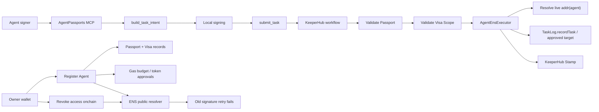

# AgentPassports.eth

**AgentPassports.eth is an ENS-native permission manager for autonomous agents.**

Owners register an Agent Passport under their ENS name, issue scoped Visas for what that agent may do, and revoke access onchain. Agents sign exact EIP-712 task intents; KeeperHub validates the live Passport/Visa state and produces KeeperHub Stamps for allowed, blocked, failed, and successful executions.

The current product is Sepolia-first and includes:

- **Register Agent** — create an ENS-backed Agent Passport and publish Visa metadata.
- **Owner Dashboard** — review Passports, Visa access, gas budget, and management actions.
- **Agent profile** — inspect live Passport proof, Visa Scope, Uniswap Visa, and KeeperHub Stamps.
- **AgentPassports MCP** — thin agent runtime for `build_task_intent` → local signing → `submit_task` → `check_task_status`.
- **Owner-funded Uniswap path** — owner wallet holds/approves tokens; KeeperHub validates policy and calls `AgentEnsExecutor.executeOwnerFundedERC20` only after Passport/Visa gates pass.

## Why ENS is central

ENS is the public identity and revocation layer, not decorative profile data.

- `assistant.alice.eth` is the human-readable Agent Passport.
- `addr(agent)` is the currently authorized signer.
- ENS text records expose owner, status, Visa digest, Visa URI, Visa target, Visa selector, and Visa Scope metadata.
- Revocation is live: updating ENS or disabling a Visa changes authorization for the next execution.
- Public resolver reads make Passport/Visa state inspectable by the app, KeeperHub, and auditors.

The executor resolves live ENS state during execution instead of trusting a stale signer stored in an offchain database.

## Architecture



The key trust boundary is split cleanly:

- **MCP is thin**: it builds unsigned intents from explicit public inputs, accepts externally signed payloads, submits to KeeperHub, and polls status.
- **KeeperHub is authoritative**: it validates Passport/Visa records, routes blocked stamps, and executes the workflow.
- **AgentEnsExecutor is the onchain verifier**: it resolves the current ENS signer, verifies the EIP-712 signature, and executes only the approved target/calldata.

## Deployed addresses

Current Sepolia deployment:

| Item | Sepolia value |
|---|---|
| `AgentEnsExecutor` | `0xce3e365214568E96d4186464089438a89331941F` |
| `TaskLog` | `0x9f384B659da5F24994BC5c2a10B4243F07aA889b` |
| ENS registry | `0x00000000000C2E074eC69A0dFb2997BA6C7d2e1e` |
| NameWrapper | `0x0635513f179D50A207757E05759CbD106d7dFcE8` |
| Public resolver | `0xE99638b40E4Fff0129D56f03b55b6bbC4BBE49b5` |
| Uniswap SwapRouter02 | `0x3bFA4769FB09eefC5a80d6E87c3B9C650f7Ae48E` |
| SwapRouter02 `exactInputSingle` selector | `0x04e45aaf` |

## Product flow

1. Owner connects a wallet on `/register`.
2. Owner registers an Agent Passport such as `assistant.alice.eth`.
3. The app prepares ENS record writes for Passport identity and Visa metadata.
4. Visa metadata is generated by the app and pinned through Pinata when configured.
5. Owner reviews the wallet transaction queue and writes Passport/Visa records onchain.
6. Agent uses MCP to build an unsigned task intent from explicit public task data.
7. Agent signs locally; MCP never sees the private key.
8. MCP submits the signed payload to KeeperHub.
9. KeeperHub reads Passport/Visa state, stamps allowed or blocked evidence, and executes only if every gate passes.
10. Owner can revoke access by disabling the Visa, changing the Passport signer, deleting the Passport, or withdrawing gas budget.

Classic TaskLog demo path:

```txt
ENS name -> agent metadata -> signed task -> live ENS verification -> task execution -> revocation failure
```

The Uniswap path uses the same trust model with a different Visa target: the owner wallet holds `tokenIn`, approves the executor separately, and KeeperHub validates the Uniswap Visa before calling `executeOwnerFundedERC20`.

## One-command agent install

Give this to any agent runtime that needs to use AgentPassports:

```bash
curl -fsSL https://agentpassports.eth/install | bash
```

The installer downloads the AgentPassports Skill Pack from GitHub, installs the skill docs/scripts locally, and creates two helper commands:

```bash
agentpassports-create-key
agentpassports-sign-intent --input build-task-intent.json
```

Use it like this:

1. Run the installer command above.
2. Run `agentpassports-create-key` in the agent's working directory.
3. Register the printed public signer address in the AgentPassports web app.
4. Ask the agent to read the installed `SKILL.md`.
5. Use the thin MCP flow: `build_task_intent` -> local signing -> `submit_task` -> `check_task_status`.

Safety rules:

- The installer does not read or write `.env` files.
- It does not create or overwrite a private key unless run with `--create-key`.
- Private keys stay local in `.agentPassports/keys.txt`.
- MCP never receives private keys and never validates Passport/Visa state locally.
- KeeperHub remains authoritative for Passport/Visa checks and KeeperHub Stamps.

The `/install` endpoint serves [`scripts/install-agentpassports.sh`](./scripts/install-agentpassports.sh). Agents can inspect it before running:

```bash
curl -fsSL https://agentpassports.eth/install -o install-agentpassports.sh
less install-agentpassports.sh
bash install-agentpassports.sh
```

If the hosted app route is unavailable, use the raw GitHub installer directly:

```bash
curl -fsSL https://raw.githubusercontent.com/sarvesh1327/agentpassports.eth/main/scripts/install-agentpassports.sh | bash
```

## Environment variables

Copy `.env.example` to `.env` and `apps/web/.env.example` to `apps/web/.env`. Keep all real secrets local.

| Variable | Used by | Purpose |
|---|---|---|
| `NEXT_PUBLIC_CHAIN_ID` | Web | Sepolia chain id, currently `11155111`. |
| `NEXT_PUBLIC_ENS_REGISTRY` | Web/contracts | Sepolia ENS registry. |
| `NEXT_PUBLIC_NAME_WRAPPER` | Web/contracts | Sepolia NameWrapper for wrapped-owner checks. |
| `NEXT_PUBLIC_PUBLIC_RESOLVER` | Web | Resolver used for subname/text record writes. |
| `NEXT_PUBLIC_RPC_URL` | Web | Optional public/browser read RPC. Leave blank to use wallet/provider defaults. |
| `NEXT_PUBLIC_EXECUTOR_ADDRESS` | Web | Current `AgentEnsExecutor`. |
| `NEXT_PUBLIC_TASK_LOG_ADDRESS` | Web | Current `TaskLog`. |
| `NEXT_PUBLIC_TASK_LOG_START_BLOCK` | Web | Start block for bounded `TaskRecorded` event reads. |
| `AGENTPASSPORT_DB_PATH` / `AGENT_DIRECTORY_DB_PATH` | Web API | Optional local SQLite path override. |
| `RELAYER_PRIVATE_KEY` | Relayer API | Server-only relayer key for direct TaskLog execution paths. |
| `RELAYER_RESERVATION_REDIS_REST_URL` / `RELAYER_RESERVATION_REDIS_REST_TOKEN` | Relayer API | Optional production Redis reservation lock. |
| `PINATA_JWT` or `PINATA_API_KEY` + `PINATA_SECRET_API_KEY` | Web API | Server-only credentials for Visa metadata uploads. |
| `KEEPERHUB_API_KEY` | MCP/Web API | Server-only KeeperHub credential. |
| `KEEPERHUB_API_BASE_URL` | MCP/Web API | Defaults to `https://app.keeperhub.com`. |
| `KEEPERHUB_WORKFLOW_ID` | MCP/Web API | Local KeeperHub workflow id. Keep concrete values out of public docs. |
| `EXECUTOR_ADDRESS` / `TASK_LOG_ADDRESS` | MCP/scripts | Runtime aliases for non-browser tools. |
| `RPC_URL` / `SEPOLIA_RPC_URL` | Scripts/contracts | Server-only RPC endpoints. |
| `PRIVATE_KEY` / `AGENT_PRIVATE_KEY` | Scripts/agent runner | Local deployment or signing keys. Never expose to MCP or the browser. |
| `ETHERSCAN_API_KEY` | Contracts | Optional contract verification. |
| `UNISWAP_API_KEY` / `UNISWAP_BASE_URL` | Optional helpers | Optional quote/build API helpers; KeeperHub still validates execution. |

## Setup

Prerequisites:

- Node.js 22+
- pnpm 9+
- Foundry for Solidity tests and deployments

Install dependencies:

```bash
pnpm install
```

Create local env files:

```bash
cp .env.example .env
cp apps/web/.env.example apps/web/.env
cp agent-runner/.env.example agent-runner/.env
cp contracts/.env.example contracts/.env
```

Run the web app:

```bash
pnpm --filter @agentpassport/web dev
```

Run the MCP server:

```bash
pnpm mcp:http
# Streamable HTTP endpoint: http://localhost:3333/mcp
```

## Test commands

```bash
pnpm test
pnpm --filter @agentpassport/web exec tsc --noEmit
pnpm --filter @agentpassport/mcp-server exec tsc --noEmit
forge test
```

## Reproduce the Sepolia demo

1. Start the web app with Sepolia environment values.
2. Open `/register`, connect the owner wallet, and create an Agent Passport.
3. Review the Prepared Passport and wallet transaction queue.
4. Open `/owner/<owner-name>` to inspect registered Passports, Visa access, and gas budget.
5. Open `/agent/<agent-name>` to inspect Passport proof, Visa Scope, Uniswap Visa, and KeeperHub Stamps.
6. Connect an MCP-capable agent to `http://localhost:3333/mcp`.
7. Call `build_task_intent`, sign the exact returned typed data locally, call `submit_task`, then poll `check_task_status`.
8. Confirm the KeeperHub execution id, final status, tx hash when present, or blocked/failed KeeperHub Stamp.
9. Revoke the Visa or update the Passport signer and retry the saved old payload; the retry fails because authorization uses live ENS/Passport state.

## Known limitations

- Sepolia is the supported network for this deployment.
- KeeperHub credentials, RPC URLs, Pinata credentials, and private keys must remain server-only/local.
- Owner-funded Uniswap swaps require the owner wallet to hold `tokenIn` and approve the executor outside MCP.
- MCP does not quote swaps, create keys, resolve ENS Passport state, validate Visas, or preflight KeeperHub decisions.
- Browser event reads are bounded by `NEXT_PUBLIC_TASK_LOG_START_BLOCK`; production deployments should use durable indexing for high-volume history.
- SQLite persistence is intended for local/demo operation unless replaced by production storage.
- Custom resolver, CCIP Read, and multi-chain production routing are not part of the current Sepolia release.

## License

Licensed under the [Apache License 2.0](./LICENSE).
